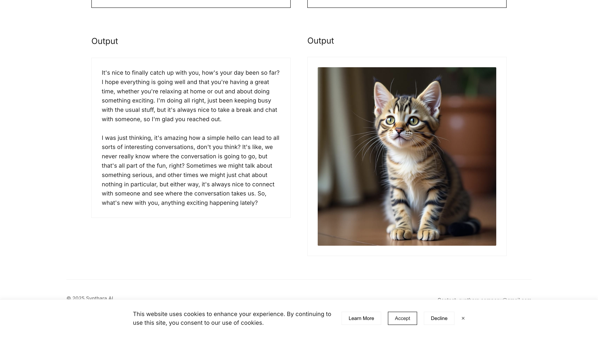

# Synthara AI - Text & Image Generation

[](https://github.com/bniladridas/synthara-ai)
[](https://vercel.com)
[](https://vercel.com)
[](https://flask.palletsprojects.com/)
[](https://www.python.org)
[](https://www.together.ai)
[](https://opensource.org/licenses/Apache-2.0)
[](https://github.com/bniladridas)

A web application that uses Together AI's API to generate text and images with advanced AI models.



## Quick Start

```bash
# Clone the repository
git clone https://github.com/bniladridas/software.git
cd software

# Set up environment
python -m venv .venv
source .venv/bin/activate  # On Windows: .venv\Scripts\activate
pip install -r requirements.txt
pip install together
pip install Flask==2.0.1 Werkzeug==2.0.1

# Create .env file with your API key
echo "TOGETHER_API_KEY=your_api_key_here" > .env

# Run the server
python simple_app.py
```

Then open http://127.0.0.1:5001 in your browser.

The server will start in debug mode and automatically reload when you make changes to the code. You should see output similar to:

```
INFO:__main__:Together API client initialized successfully
* Serving Flask app 'simple_app' (lazy loading)
* Environment: production
  WARNING: This is a development server. Do not use it in a production deployment.
* Debug mode: on
INFO:werkzeug: * Running on http://127.0.0.1:5001/ (Press CTRL+C to quit)
```

To stop the server, press CTRL+C in the terminal.

## Features

- Text generation using Llama-3.3-70B, DeepSeek-R1-70B, and Llama-4-Maverick-17B models
- Image generation using FLUX.1-dev model
- Clean, minimalist interface
- API key management for premium models

## Usage

### Text Generation

1. Select a text model from the dropdown menu
2. Enter your prompt in the text area
3. Press Enter or click the "Generate" button
4. View the generated text in the output area
5. Use the copy button to copy the text to your clipboard

### Image Generation

1. Select an image model from the dropdown menu
2. Enter a descriptive prompt in the text area
3. Press Enter or click the "Generate" button
4. View the generated image in the output area

### Using Premium Models

For premium models like Llama-4-Maverick-17B, you'll need to provide your own Together AI API key:

1. Navigate to the API Key Setup page
2. Follow the instructions to obtain an API key from Together AI
3. Enter your API key in the form
4. Your key will be stored locally in your browser
5. You can now use premium models with your API key

## Deployment on Vercel

This application is configured for deployment on Vercel:

1. Fork or clone this repository to your GitHub account
2. Connect your GitHub repository to Vercel
3. Add the `TOGETHER_API_KEY` environment variable in the Vercel project settings
4. Deploy!

For detailed deployment instructions, see [VERCEL_DEPLOYMENT.md](VERCEL_DEPLOYMENT.md).

## Environment Variables

- `TOGETHER_API_KEY`: Your Together AI API key (required)

## Author

**Niladri Das** - [GitHub](https://github.com/bniladridas)

## License

© 2025 Synthara AI - Licensed under the [Apache License, Version 2.0](LICENSE)

```
Copyright 2025 Niladri Das

Licensed under the Apache License, Version 2.0 (the "License");
you may not use this file except in compliance with the License.
You may obtain a copy of the License at

    http://www.apache.org/licenses/LICENSE-2.0

Unless required by applicable law or agreed to in writing, software
distributed under the License is distributed on an "AS IS" BASIS,
WITHOUT WARRANTIES OR CONDITIONS OF ANY KIND, either express or implied.
See the License for the specific language governing permissions and
limitations under the License.
```
